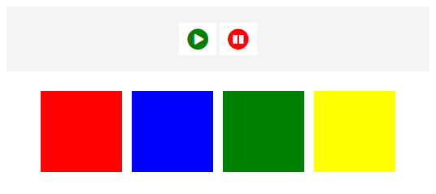

# [Intro to Anime.js - The JavaScript Animation Engine](https://www.youtube.com/watch?v=g7WnZ9hxUak)

In this tutorial, we are going to use Anime.js JavaScript animation engine to create a simple app with some element animation that we can play and pause.

[View demo site here.](https://webdevtuts.github.io/animejs_sandbox/)

